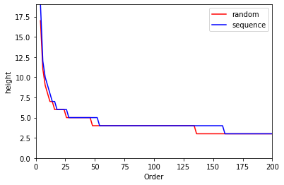

# External Memory: B-Trees

A B-Tree is a balanced data structure that generalizes binary search trees. B-Trees are known for their ability to efficiently handle insertion, deletion, and search operations, making them commonly used in databases and filesystems.

## Insertion and Splitting

Inserting a new key in a B-Tree requires maintaining balance. If a node is full (contains exactly `t-1` keys, where `t` is the tree's order), a division operation is performed at the median key. The full node is split into two nodes, each containing `(t-1)/2` keys, and the median key is moved to the parent node.

This project explores the performance of B-Trees after insertion, with a focus on the insert and split operations.

For detailed information and code, please refer to the project's files and documentation.

## Results

### Order vs. Height

- Tree height remains similar when inserting random values or an increasing sequence, thanks to B-Tree's self-balancing properties.
- Higher-order trees have shorter heights due to increased storage capacity, resulting in fewer splits.

### Order vs. Time

- Surprisingly, inserting a long sequence of values is faster than inserting random values.
- Time differences are not strictly inversely proportional to order; lower-order trees sometimes perform faster.

### Order vs. Splits

- Inserting a sequence leads to more splits compared to random values.
- The overall trend shows that higher-order trees perform fewer splits.
- Order and the number of splits are inversely proportional.

For more details and data, please consult the project's documentation.

